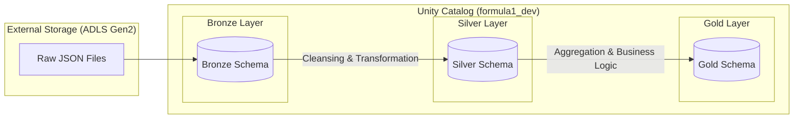
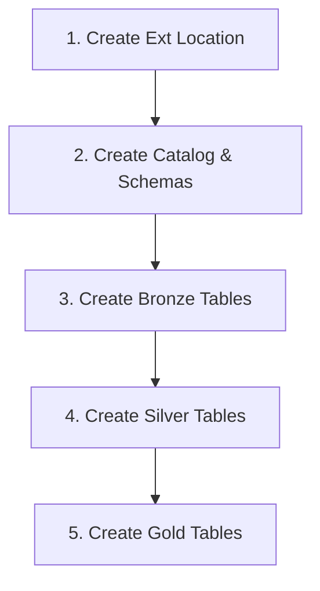

# 🏎️ Ergast Formula 1 Data Engineering Mini Project: Databricks Medallion Architecture

---

## 📌 Project Overview

This project is a comprehensive Databricks implementation designed to demonstrate and master the **Medallion Architecture**, **Azure Databricks Workflows**, and **Unity Catalog** management. Using the famous **Ergast Formula 1 Dataset**, the pipeline ingests raw data, transforms it through several layers of refinement, and ultimately produces analytical insights into driver performances and race results.

The primary goal was to build a robust, scalable, and governed data lakehouse using modern Azure data engineering practices.

---

## 🛠️ Tech Stack

The project leverages the following technologies:

- **Platform:** ☁️ Azure Databricks
- **Languages:** 🐍 Python (PySpark), 💾 SQL
- **Storage:** 📁 Azure Data Lake Storage Gen2 (ADLS)
- **Governance:** 🛡️ Unity Catalog
- **Orchestration:** ⚙️ Databricks Workflows (Jobs)
- **Data Format:** 📐 Delta Lake

---

## 🏗️ Medallion Architecture

The project follows the standard three-layer Medallion Architecture to ensure data quality and lineage.

### 🏢 Architecture Diagram

### 1. 🥉 Bronze Layer (Ingestion)

- **Source:** Raw JSON files stored in ADLS Gen2.
- **Implementation:** Creates **External Locations** in Databricks and maps them to Delta tables.
- **Content:** Raw data as-is from the source (e.g., `drivers.json`, `results.json`).
- **Purpose:** Initial landing zone for data with minimal changes.

### 2. 🥈 Silver Layer (Cleansing)

- **Process:** Data is read from Bronze, cleaned, and stored as **Managed Tables**.
- **Transformations:**
  - Renaming columns from CamelCase to snake_case (e.g., `driverId` to `driver_id`).
  - Concatenating name fields (e.g., `forename` + `surname` = `name`).
  - Adding audit columns like `ingestion_date` using `current_timestamp()`.
- **Purpose:** Provides a "Single Source of Truth" for downstream consumption.

### 3. 🥇 Gold Layer (Analytics)

- **Process:** High-level aggregations and business-level joins.
- **Example:** The `driver_wins` table is created by joining `drivers` and `results`, filtering for 1st place finishes, and counting wins per driver.
- **Purpose:** Consumption-ready data for BI tools and Dashboards.

---

## 🛡️ Unity Catalog Governance

The project implements **Unity Catalog** for centralized access control and data discovery.

- **Catalog:** A dedicated catalog `formula1_dev` was created to isolate development workloads.
- **Schemas:** Three schemas (`bronze`, `silver`, `gold`) were implemented to logically separate the data layers.
- **Data Discovery:** Used `system.information_schema` to track table metadata, owner details, and storage locations across the catalog.
- **Access Control:** Managed locations were used for Silver and Gold layers to let Databricks handle the underlying storage lifecycle.

---

## ⚙️ Workflows & Job Scheduling

Data processing is automated using **Databricks Workflows**, allowing for modular notebook execution and trigger-based runs.

### 📈 Workflow DAG

The workflow follows a sequential dependency structure to ensure data integrity across layers.

### 🕒 Schedules & Monitoring

- **Job Runs:** Automated triggers were configured to run the pipeline on a schedule.
- **Monitoring:** The **Job Timeline** and **Run History** (as seen in `mini_timeline.JPG` and `mini_job_schedule.JPG`) provide visual insights into task duration and success/failure rates.
- **DAG Visualization:** The `mini_DAG.JPG` illustrates the task dependencies within the Databricks UI.

---

## 📖 Data Model

The project uses the **Ergast F1 Schema**, involving several interconnected tables:

- **Circuits:** Details about race tracks.
- **Drivers:** Personal information and unique identifiers for racers.
- **Constructors:** Team details.
- **Races:** Dates and locations of Grand Prix events.
- **Results:** Detailed performance data for every driver in every race.

For more details on the schema, refer to the [Formula 1 User Guide](<file:///c:/Users/sagar/Documents/Udemy%20courses/Udemy%20Azure%20Databrics%20Udemy/Formula1%20-%20My%20files/Databricks%20Mini%20Project%20(%20medallion%20understanding%20)/formula1_ergast_data_user_guide.txt>).

---

## 🚀 How to Use this Project

1.  **Environment Setup:** Ensure you have an active Azure Databricks workspace with Unity Catalog enabled.
2.  **ADLS Connection:** Configure Storage Credentials and External Locations for your bronze, silver, and gold containers.
3.  **Run Order:**
    - Execute the `1. transformation tables` notebooks in numerical order.
    - Use the `2. unity_catalog` notebooks for data discovery and validation.
4.  **Workflows:** Create a new Job in Databricks and add the notebooks as tasks following the order outlined in the DAG section.

---

_This project was developed as part of a learning journey to master Azure Databricks and Modern Data Architectures._
